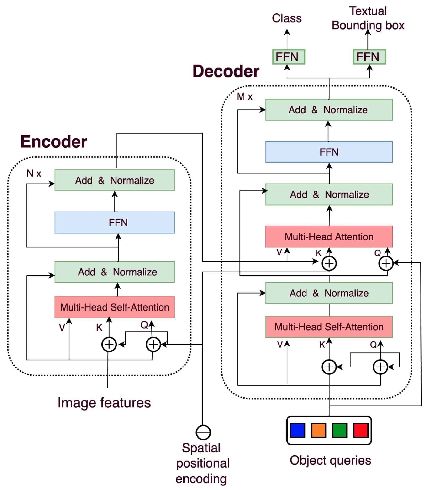
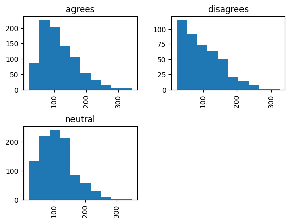
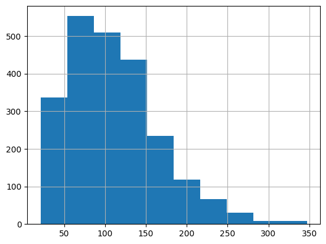
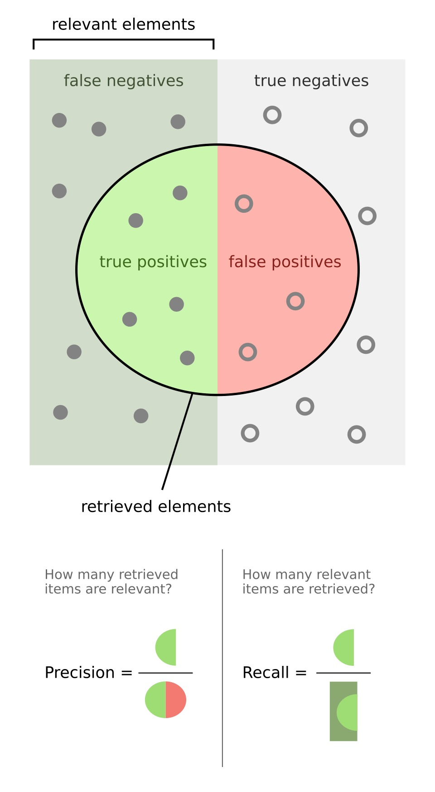
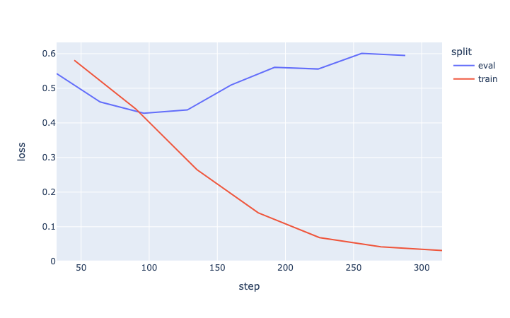
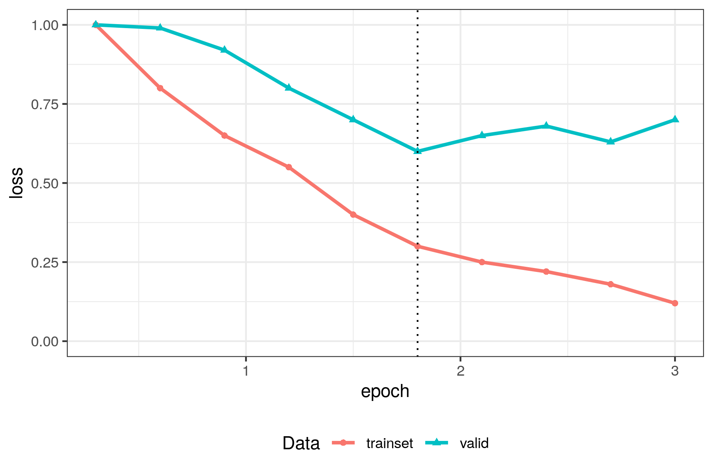
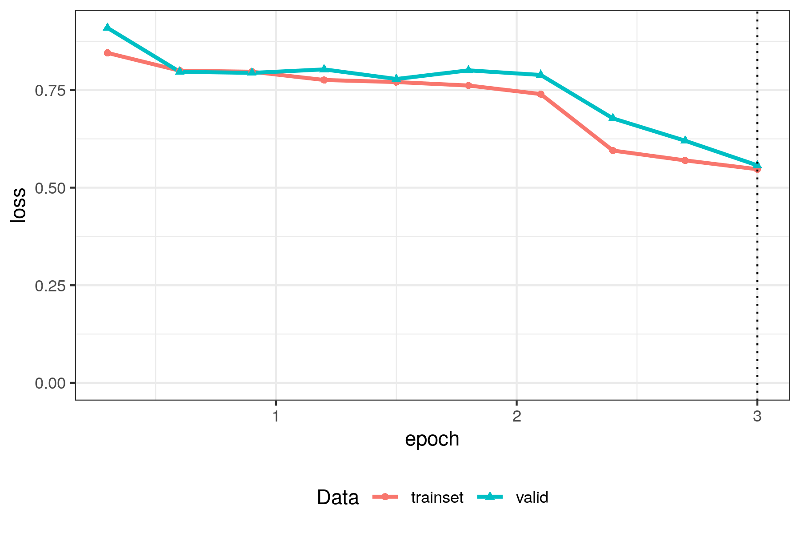

# Introduction

It is now common practice to use LLMs ~~(encoders or decoders)~~ to annotate texts in the context of social science research (Gilardi et al., 2023; Bonikowski et al, 2022; Do et al., 2022). If LLMs provide cost-effective and rapid alternatives for scaling studies, there is different way to use them.

Not all uses are the same, and different architecture of LLMs can be used. Especially, one important distinction is the one between encoders and decoders architecture, leading to 2 different strategies to annotate texts:

::: {.callout-warning}
Je commencerai le tutoriel de manière un peu plus douce sur les principales notions, là ça rentre vraiment dans le dur rapidement. Plus, il y a trois stratégies : encoder non finetuné, encoder finetuné et décodeur en inférence non ? On ne parle pas de plongement seuls + ML. Donc peut être un peu mieux situer l'approche, de manière un peu plus intuitive. Et peut être aussi introduire ici le fait qu'un humain est capable d'annoter et qu'on veut étendre cette équation humaine. 
:::

- Using encoder models: from texts, models create embeddings to represent each text (a vector of several hundred of values) used then as predictors to perform the classification. This strategy is illustrated in the Augmented Social Scientist tutorial, which requires some coding skills as well as a computer capable of loading and running the model.
- Using decoder models: from a prompt, ie the concatenation of the text to annotate as well as the codebook, we ask a model to generate the labels as text. This strategy is easier to implement as fewer coding skills are required, and models run on external machines. This nonetheless has drawbacks,   <!-- TODO Reprendre les conclusions du tuto decoder -->

In a previous tutorial, we demonstrated how to make API calls with the `openai`library ([available here](https://www.css.cnrs.fr/classification-with-generative-llms-and-api-calls/)). In this tutorial, we explore the other solution: fine-tuning an encoder model. Alternatively, you can use ActiveTigger, a software developed by our team that facilitates the use of models in the social sciences.

<!-- TODO: write a pros and cons of the two methods -->

## Objectives and materials

In this tutorial we will :

- Understand the general pipeline for text classification with encoder models
- Develop some familiarity with preprocessing and training techniques
- Evaluate models' performance and their impact on downstream tasks
- Develop good practices for your research and discussing GPU issues

We will use the dataset of journal articles created by Luo et al. (2020). What you will learn: 

## Install environment: 

For this tutorial we use Python version 3.12 and setup the environment with the following command:

```bash
pip install -qU pandas "transformers==4.52.4" datasets ipykernel matplotlib torch "accelerate>=0.26.0" scikit-learn plotly "nbformat>=4.2.0"
```
However, you should know that, however convenient [PyTorch](XXX), [accelerate](XXX), and [transformers](XXX) are, these libraries may be unstable depending on your computer and environment. You **will face issues** related to your version. We recommand using conda[^4] (or the virtual environments manager of your choice[^5]) to correctly setup your environment and create a requirement file[^6] of your own once you've reached a stable workspace. Don't hesitate downgrading your libraries as they are likely to be more stable. [ES : mettre cette partie en note de bas de page ou en box warning]

[^4]: [Set up your cuda environment](https://www.youtube.com/watch?v=sDCtY9Z1bqE)

[^5]: [More on UV](XXX), XXXX

[^6]: (link to conda env > .yml) + for UV

<!-- TODO: add requirement files -->

# What is in a BERT : the encoder architecture

::: {.callout-warning}
Question : est-ce qu'on parle d'autres encodeurs que des BERT dans ce tytorial, si non : pourquoi ne pas se concentrer sur les BERT ?
:::

In this section we provide common knowledge about the encoder architecture and training; if you want to refine your understanding of the theory, we list a number of state-of-the-art resources. 

All models we discuss here are neural network models (ES: ajouter un lien ? Mentionner le deep learning ?) with specific architectures (activation nodes, pooling layers or feedback loops). Ultimately, one can see models as a sequence of matrix multiplication and vectors addition where the coefficients of the matrices and vectors (the weights) have been optimised for a certain task. The Transformer architecture, is one way of agencing nodes together. In one of the most famous paper in NLP (["Attention is all you need"](https://en.wikipedia.org/wiki/Attention_Is_All_You_Need)), a team from Google introduced the concept of *attention* which attempts to take into account the context in which a word is used.  

{#fig-transformer-architecture width=50%}

This transformer structure contains two parts, the encoder and the decoder

::: {.callout-warning}
Pas clair, tu passes de l'architecture aux modèles disponibles et utilisés; Je pense qu'il faut séparer clairement qu'il y a des conceptions d'une part, et des gens qui créent les modèles et les utilisent de l'autre. Là c'est trop lié ensemble. Notamment, l'architecture n'est pas entièrement liée à la taille (nombre de paramètres). 
:::

- **Decoder** models include GPT models and Llama, they often are too heavy to run on your personal laptop (smallest models have 3-8 billion prameters and can go up to 2,000 billion). They also tend to be prioprietary (XXX vérifier) resulting in confidentiality and interpretability issues <!-- TODO reformulate -->. 
- **Encoder** models (also called embedding models) include BERT models and many of it's kind (CamemBERT, RoBERTa, DeBERTa, and the list is long). They are way more frugal and can be run and finetuned on most laptops[^7] (most models have between 200 and 600 million parameters). Also, these models tend to be open source. (Which does not solve issues related to the training data and all.. but it's better).<!-- TODO find back reference with model size and all -->

[^7]: It tends to be less likely as newer models tend to be larger. Read more in the [Choose and load a model](#choose-and-load-a-model) section

Those models are pre-trained on large corpus on a specific tasks that allows them to catch the pattern of the language. Training encoders (or embedding models) models is a complex task that can be carried out in many different ways. For instance, BERT was trained on two tasks (Devlin et al., 2019): [ES: les deux entrainement sont des taches complexes, il faut que tu précises que tu vas te concentrer sur les encodeurs non ?]

- Task 1: Masked LM. Take a sentence, replace some words by a `[MASK]` token, predict what was the word.
- Task 2: Next Sentence Prediction. Take two sentences A and B, classify whether it makes sense for sentence B to appear after sentence A. 

In the context of training embedding models, tasks have been adapted and redesigned but they all have the same objective [ES: pas clair ce que ça veut dire le début de phrase]: **modelling the semantic of words in context**. If done correctly, this means that two words close in meaning are close in the embedding space and that the embedding calculated takes into account the context of the sentence. In most NLP applications, the similarity score is calculated as the scalar product of the embeddings also referred to as the cosine metric.

::: {.callout-warning}
En fait là tu expliques ce que sont les embeddings... est-ce que cette notion n'est pas plus générale que les transformers, et devrait arriver avant ?
:::


{#fig-similarity width=100%}

For instance in @fig-similarity, the word "apple" and "pear" are very close in meaning, so their similarity score is very high. However, in the context of Apple's new product, the embedding has shifted with the context, now the similarity score is lower.


:::{.callout-note  collapse="true" title="Learn more the embedding space and training encoders"}

- [The illustrated transformer](https://jalammar.github.io/illustrated-transformer/)
- [What are Transformer Neural Networks](https://www.youtube.com/watch?v=XSSTuhyAmnI)
- [Jurafsky's chapter on Transformers](https://web.stanford.edu/~jurafsky/slp3/8.pdf)
- [Code your own transformer model](https://nlp.seas.harvard.edu/annotated-transformer/)

:::

One key parameter of all models is the "maximum context window". The maximum context window is the maximum number of tokens that can be digested by the model at once, anything exceeding this window is simply ignored. First models used to have very short context windows (between 128 and 512 tokens maximum), meaning long texts had to be split into sentences or paragraphs. This may be a problem depending on the task at hand.


::: {.callout-example}

[ES: pas convaincu de cette partie ici, tu es encore sur la théorie et là tu viens avec un aspect très précis de tâche alors qu'on a pas vraiment parlé de labellisation encore]

Let's say you want to detect if long articles tackle environmental issues. One might need to divide the articles into paragraphs, and for each paragraph, detect if it tackles environmental issues. After inference, one would need to aggregate the results of each paragraph to obtain a global score (3 out of 6 paragraphs tackle environmental issues) or a global indicator (at leas 1 paragraph tackles environmental issues).
<br/>
This consists of an additional difficulty and requires researcher to further precise their research question and how they might answer it.

:::

Some techniques allow users to exceed the maximum context window, please refer to XXX @ Léo @ Alexandre

# Fine-tuning pipeline: the essential

In this section we will see the fundamentals to fine-tuning encoders for a classification task. We will first load a dataset introduced by Luo et al., (2020); they collected journal articles, from which they extracted sentences conveying an opinion regarding global warming. Finally, they annotated each opinion as "agreeing", "neutral" or "disagreeing" with regard to the following statement "Climate chage/global warming is a serious concern".

[ES: plutôt annoncer les étape se ce que toi tu vas faire, que de parler du papier]

## What is fine-tuning

::: {.callout-warning}
Tu ne devrais pas expliquer ce qu'est le fine-tuning? 
:::


## Load your data 

Data is available on the [project's GitHub repository](https://github.com/yiweiluo/GWStance/tree/master), we can download it from there using Pandas. 

```python 
import pandas as pd 

url = "https://raw.githubusercontent.com/yiweiluo/GWStance/refs/heads/master/3_stance_detection/1_MTurk/full_annotations.tsv"
df_raw = pd.read_csv(url, sep = "\t") # Careful here, this document is a tsv (separator="\t" and not a csv (separator = ",")

df_raw.head()
```

We will first need to explore the dataset and get a graps of its content as well as possible biases. 

As a first step, let's make a list of all the columns: 

- `sent_id`: the sentence id. It is not unique and represents something else, we will need to create a different ID.
- `sentence`: the sentence to annotate.
- `worker_#N` $N\in [1,7]$: The team tasked MTurk workers to label the data for them. Each column concatenates the labels for a given worker.
- `MACE_pred`: this is the final prediction. The team used the MACE framework to create a debiased label from the workers' labels.
- `av_rating`: The mean of all workers' annotations for a given sentence (with disagree = 1, neutral = 0, agree = 1).

Other columns include `disagree`, `agree` and `neutral` but they are empty. The `round` and `batch` columns are irrelevant for our experiment.

```python 
df = df_raw.loc[:,["sent_id", "sentence", "MACE_pred", "av_rating"]]
df = df.rename(columns={"MACE_pred" : "labe_text"}) # Rename MACE_pred for conveniency
df
```

Let's have a look at the number of elements per class:

```python
df_raw.groupby(["label_text"]).size()
```

```txt
MACE_pred
agrees       871
disagrees    441
neutral      988
dtype: int64
```

We can see that there tends to be more "neutral" or "agrees" sentences. This means that "disagrees" sentences might be trickier to spot because there will be less elements to train on.
<!-- TODO balance dataset -->

```python 
df.hist(column = "sentence-len", by="label_text")
df.groupby("label_text")["sentence-len"].describe()
```

| label_text   |   count |     mean |     std |   min |   25% |   50% |   75% |   max |
|:-------------|--------:|---------:|--------:|------:|------:|------:|------:|------:|
| agrees       |     871 | 114.91   | 56.0082 |    22 |    77 |   100 |   148 |   342 |
| disagrees    |     441 |  98.0907 | 59.0937 |    22 |    51 |    86 |   134 |   325 |
| neutral      |     988 | 110.732  | 54.4368 |    21 |    72 |   104 |   148 |   347 |



There does not seem to be a bias regarding the length of the documents.

## Preprocess your data

### Check content integrity

The preprocessing step is one of the most important step in the NLP pipeline, one needs to know what the corpus contains. We list a number of aspects you want to keep in mind when pre-processing your data:

- **Create a unique ID for each text**: Creating an index for each text ensures that you will be able to aggregate the results. If your dataset does not contain an existing ID column, you can create one using the syntax of your choice. In our case, we will create an index that will look like this: `ID-0001`.

```python 
DF_IN_USE["ID"] = [f'ID-{i:04}' for i in range(len(DF_IN_USE))]
```

- **The length of your documents**: Depending on the model used, the context window (ie the maximum length of the documents, [see previous section](#understand-the-encoder-architecture)) will vary a lot (from 500 tokens to more than 8k). Also you will need to answer this question: where is the information that you're looking for. For some tasks, you might want to work at the sentence level because you want to find specific elements of your corpus. For other tasks, working at the document or paragraph level is acceptable because you want to assess a global quantity. Depending on your task and the model chosen, you might want to split your documents. We also want to make sure that elements have roughly the same size. Indeed, we can't really compare a sentence of 5 words to 10 paragraphs. This needs to be conceptualised. 

Let's analyse the len of sentences in order to estimate how large will the context window be:

```python
df["sentence-len"] = df["sentence"].apply(len)
df["sentence-len"].hist()
df["sentence-len"].describe()
```

```txt 
count    2300.000000
mean      109.890435
std        56.251317
min        21.000000
25%        70.000000
50%       100.000000
75%       145.000000
max       347.000000
Name: sentence-len, dtype: float64
```

{#fig-sentence-length-hist width=50%}


In the context of our experiment, the sentences are quite short and their size is roughly standard. We will not exclude text inputs based on the text. Keep in mind that this model will be trained on a specific task and specific material. Performances are not guaranteed for texts too different in tone, source, date, or length from the training data.

**Are there any unwanted characters**

If you are used to [TF-IDF techniques](XXX), you might be accoustumed to filtering punctuations and stop words. This is not something that we want to do when using transformers models. Indeed these models are trained with these characters. On top of that they convey meaningful context to the model. However, you might want to filter out elements that, for your study, do not carry semantic value. For instance, when working on social media content, depending on your problematic, you will want to either keep or remove emojis for instance[^1]. At the end of the day, you want to make sure that the elements you keep in your text carry semantic information necessary for the annotation process.

[^1]: you need to make sure that the model that you are using does recognise emojis

Our corpus is relatively clean given that the preprocessing stage happened in the earlier stages of the study. Skimming through the text entries, we can still find some irregularities regarding the punctuation. Let's fix this: 

```python 
def preprocess_text(text: str):
    if not(isinstance(text, str)):
        return pd.NA
    return (
        text
        .replace("``", '"')
        .replace("''", '"')
        .replace(" ,", ",")
        .replace(" .", ".")
        .replace(" !", "!")
        .replace(" ?", "?")
        .replace(" :", ":")
        .replace(" 's", "'s")
    )

df["sentence-preprocessed"] = df["sentence"].apply(preprocess_text)
```

- **Are there any duplicates?** This can be a fatal flaw as training a model with repeated elements can outweight other annotation or completely confuse it. 

Let's see if we have duplicates elements. 

```python 
df.groupby("sentence").size().value_counts()
```

```txt 
1     2034
2        8
50       5
Name: count, dtype: int64
```

We can see that 5 elements are duplicated 50 times. Further inverstigations let us identify that sentences with indexes starting with an "s" (`['s0', 's1', 's2', 's3', 's4']`) are duplicated 50 times. Let's remove these rows.

```python 
df_no_duplicates = df.loc[~df["sent_id"].str.startswith("s"), :] 
df_no_duplicates.groupby("sentence").size().value_counts()
```

We still need to deal with the 8 elements that have a duplicate. We would like to use the `drop_duplicates` function, but to do so, we need to make sure that the label of the two duplicates are the same. Let's check if some sentence are the same with a concensus on the label: 

[ES: C'est vraiment la règle à suivre ? On garde des éléments identiques avec des annotations discordantes ? Question de curiosité]

```python 
df_concensus = df_no_duplicates.groupby("sentence")["label_text"].agg(concensus = lambda X : len(set(X)) == 1)
print(df_concensus[df_concensus["concensus"] == False])
```

| sentence                                         |   concensus |
|:-------------------------------------------------|------------:|
| We need to get rid of fossil fuel subsidies now. |       False |

One sentence does not reach a concensus, We are going to remove it by hand and then use the `drop_duplicates` function: 

```python 
df_no_duplicates = df_no_duplicates.loc[
    df_no_duplicates["sentence"] != "We need to get rid of fossil fuel subsidies now.",
    :
]
df_no_duplicates = df_no_duplicates.drop_duplicates("sentence")
```

As a final check, we can use the Levenshtein distance to make sure that there are no lasting duplicates: 

```python
from Levenshtein import distance as lev_distance

threshold = 10

for i in range(len(df_no_duplicates)):
    for j in range(i + 1, len(df_no_duplicates)):
        s1 = df_no_duplicates.iloc[i]["sentence"]
        s2 = df_no_duplicates.iloc[j]["sentence"]
        d = lev_distance(s1, s2)
        if d < threshold:
            print(f"{d} : {s1} || {s2}")
```

With this loop, we have found 6 new sentences with duplicates:

- Global warming isn’t happening. || Global warming isn't happening.
- There is no solid evidence of global warming. || There is not solid evidence of global warming.
- Balance of evidence suggests a discernible human influence on global climate. || The balance of evidence suggests a discernible human influence on global climate.
- The alleged “ consensus ” behind the dangers of anthropogenic global warming is not nearly as settled among climate scientists as people imagine. || The alleged “ consensus ” behind the dangers of anthropogenic global warming is not nearly as settled among climate scientists as people imagine.
- Rising global temperatures during the 19th and 20th centuries may be linked to greater plant photosynthesis. || Rising global temperatures during the 19th and 20th centuries could be linked to greater plant photosynthesis.
- Climate change will continue to affect all types of weather phenomena and subsequently impact increasingly urbanised areas. || Climate change will continue to affect all types of weather phenomena and subsequently impact increasingly urbanized areas.

From there, one can choose to remove them or not. For this tutorial we will remove one of them if the two have the same label and remove both if they don't.

```python 
last_duplicates = [
    ("Global warming isn’t happening.","Global warming isn't happening."),
    ("There is no solid evidence of global warming.","There is not solid evidence of global warming."),
    ("Balance of evidence suggests a discernible human influence on global climate.","The balance of evidence suggests a discernible human influence on global climate."),
    ("The alleged “ consensus ” behind the dangers of anthropogenic global warming is not nearly as settled among climate scientists as people imagine.","The alleged “ consensus ” behind the dangers of anthropogenic global warming is not nearly as settled among climate scientists as people imagine."),
    ("Rising global temperatures during the 19th and 20th centuries may be linked to greater plant photosynthesis.","Rising global temperatures during the 19th and 20th centuries could be linked to greater plant photosynthesis."),
    ("Climate change will continue to affect all types of weather phenomena and subsequently impact increasingly urbanised areas.","Climate change will continue to affect all types of weather phenomena and subsequently impact increasingly urbanized areas."),
]

for (s1, s2) in last_duplicates:
    lab_s1 = df_no_duplicates.loc[df_no_duplicates["sentence"] == s1, "label_text"]
    lab_s2 = df_no_duplicates.loc[df_no_duplicates["sentence"] == s2, "label_text"]
    if lab_s1.item() == lab_s2.item() : 
        df_no_duplicates.drop(index = lab_s2.index)
    else: 
        df_no_duplicates.drop(index = [*lab_s1.index, *lab_s2.index])
```

### Create splits

The final step is to create a train set, a train-eval set, dev set and final-eval set (also called splits). 

- the **train set** is the set of sentences is used for training, weights are updated after comparing the predictions with the gold standard labels. 
- the **train-eval** is the set of sentences is used for training, but weights are **not** updated after comparing the predictions with the gold standard labels. Instead they evaluate the model's capabilites to generalise to unseen content. These sentences are said to be "seen" by the model; using this set for final evaluation will produce boosted results.
- the **dev set** is the set of sentences that are used to evaluate a model and choose Hyperparameters. They are not seen by the model but they are part of the optimisation process.
- the **final-eval** set is the set of sentences that are used to produce realistic performance evaluation. This set of sentences is not seen by the model during training and prevent from biasing the hyperparameter optimisation due to cherry picking.

[ES: la terminologie est différente de ActiveTigger, sur quoi on se base pour ne pas avoir eval / test ? JE pense que ça doit être cohérent entre nos outils et nos leçons non ?]

In general, we allocate 70% of the data to the train set, then 10% to train eval, dev set and final eval set. Depending on the size of your dataset, you might want to tweak this distribution. Ultimately, you want enough data for training and evaluation for scores to be significative.

```python 
CODE FOR CREATING A COLUMN SPLIT
```

**Stratification of the splits**  <!-- Move to good practices ??? -->

_The process of stratification consists of creating subgroups as defined by meta data (years for instance) and selecting a same number of texts per subgroup. This process intends to produce a dataset with uniform distribution across the selected metadata._

You dataset may contain additional variations through years, or sources. To make sure that these variations do not bias your model, you may want to stratify your splits according to said dimensions. If your dataset contains underrepresented labels, you can also choose to stratify your sets using the label column in order to create balanced splits which will contain as many texts per label.

In our case, we don't have additional metadata to stratify our splits with, also, the label distribution is not too unbalanced that we have to stratify the splits. We will not proceed to any stratification. 

If you were to do stratify your dataset, here is a code snippet to do it: 

```python
stratification_column = ["year"]
sub_groups = df.groupby(stratification_column, as_index = True)
samples_per_stratum = min(sub_groups.size())
df_stratified = (
    sub_groups
    .apply(lambda x : x.sample(n = samples_per_stratum))
    .reset_index()
    # .drop(["level_0", "level_1"], axis = 1) # Some additional columns will appear, you may want to drop them
)
```

## Choose and load a model

We will start with a pre-trained model and then fine-tune it on our specific data. How to choose such model ?

In this tutorial we use the Transformers package, maintained by [HuggingFace](https://huggingface.co/)[^huggingface]. They propose a range of open source models and datasets downlable through their API. In the context of this tutorial, we will start working with the famous BERT models named: [google-bert/bert-base-uncased](https://huggingface.co/google-bert/bert-base-uncased)

[^huggingface]: HuggingFace is a company (for profit ?) specialised in NLP and machine learning. They maintain many SOTA libraries such as [Transformers](XXX), [Datasets](XXX) or [Sentence Transormers](XXX). On top of maintaining the libraries, they publish posts about the latest tech, tutorials on their libraries, host a forum for debugging but also propose inference and training solutions if you don't have access the required hardware.


:::{.callout-note title="How to choose a model"}

Models and their performance is highly sensitive to the task and context of usage. When implementing an NLP task you might want to try several models to compare their performance. When choosing a model you want to take into account the following parameters: 

- What task was the model trained for? You can see the list of tasks when [browsing HuggingFace's models](https://huggingface.co/models). In the context of this tutorial, we want to perform a **Text Classification** task. 
- What language was the model trained on? This one is trivial. However, depending on your corpus, you might want to find models that are multilingual. Performance of multilingual models can be below monolingual models; consider trying different models (is it still true ?? @ Léo). You can also try and translate your corpus into one language and use a monolingual model. 
- What documents was the model trained on? Evaluated on? Models performance can vary a lot when used on a certain domain or another. Make sure to use models that have been XXX BENCSSMARK @ Etienne @ Paul 
- Last but not least: How big is the model? You won't get away with it, your laptop has limited computation capabilities, large models won't run on any laptip. Know your hardware and check what model you can run [using this method](XXX). <!-- TODO find a method lols -->
- Is the model still relevant : look how many time the model is download to have a sense of the community using them. Don't hestiate to look if newer model are available since models also have versions.

:::

To load the model we just need to use one of the AutoModel instance. Auto Classes are ready-to-use classes that will set up the right architecture depending on your task. In our case we are going to use the [`AutoModelForSequenceClassification`](https://huggingface.co/docs/transformers/en/model_doc/auto#transformers.AutoModelForSequenceClassification). To load the model we use the following command: 

```python 
from transformers import AutoModelForSequenceClassification

labels = list(df["label_text"].unique())
num_labels = len(labels)
id2label = {id:label for id, label in enumerate(labels)}
label2id = {label:id  for id, label in enumerate(labels)}

MODEL_NAME = "google-bert/bert-base-uncased"
model = AutoModelForSequenceClassification.from_pretrained(
    MODEL_NAME, 
    num_labels=num_labels,
    id2label=id2label,
    label2id=label2id, 
    device="cpu"                                          
)
```

_Nota: for some models you might need to set `trust_remote_code` to `True`. Make sure you trust the model you are downloading._

We can easily observe the general architecture of the model by typing: 

```python
print(model)
```

:::{.callout-note title="Model description"}
```txt 
BertForSequenceClassification(
  (bert): BertModel(
    
    >>> This is the first step of the encoding process, use ready made embeddings 
    that will be modified with attention. We can find useful information: 
    - 30522 is the vocab size, there are 30522 entities for which there is a ready 
    made embedding.
    - 768 is the dimension of the output embeddings

    (embeddings): BertEmbeddings(
      (word_embeddings): Embedding(30522, 768, padding_idx=0)
      (position_embeddings): Embedding(512, 768)
      (token_type_embeddings): Embedding(2, 768)
      (LayerNorm): LayerNorm((768,), eps=1e-12, elementwise_affine=True)
      (dropout): Dropout(p=0.1, inplace=False)
    )

    >>> This is where the attention takes place. You can see that the encoder is a
    stack of 12 BERTlayers, themselves containing a self attention module. We find 
    again the dimension of the output embeddings: 768

    (encoder): BertEncoder(
      (layer): ModuleList(
        (0-11): 12 x BertLayer(
          (attention): BertAttention(
            (self): BertSdpaSelfAttention(
              (query): Linear(in_features=768, out_features=768, bias=True)
              (key): Linear(in_features=768, out_features=768, bias=True)
              (value): Linear(in_features=768, out_features=768, bias=True)
              (dropout): Dropout(p=0.1, inplace=False)
            )
            (output): BertSelfOutput(
              (dense): Linear(in_features=768, out_features=768, bias=True)
              (LayerNorm): LayerNorm((768,), eps=1e-12, elementwise_affine=True)
              (dropout): Dropout(p=0.1, inplace=False)
            )
          )
          (intermediate): BertIntermediate(
            (dense): Linear(in_features=768, out_features=3072, bias=True)
            (intermediate_act_fn): GELUActivation()
          )
          (output): BertOutput(
            (dense): Linear(in_features=3072, out_features=768, bias=True)
            (LayerNorm): LayerNorm((768,), eps=1e-12, elementwise_affine=True)
            (dropout): Dropout(p=0.1, inplace=False)
          )
        )
      )
    )

    >>> This pooler is the component that will take the embedding of each token in 
    the sequence and produce a unique embedding, supposedly best representing the sequene.

    (pooler): BertPooler(
      (dense): Linear(in_features=768, out_features=768, bias=True)
      (activation): Tanh()
    )
  )
  (dropout): Dropout(p=0.1, inplace=False)

  >>> This last component is the classifier layer, a neural network composed of 768 
  + 3 nodes. The out_features=3 corresponds to the number of labels we are using for 
  annotation! 

  (classifier): Linear(in_features=768, out_features=3, bias=True)
)
```

:::

:::{.callout-note title="Tips and tricks regarding the model"}

The `AutoConfig` class is very convenient for retrieveing information that may be difficult to access otherwise. We load it like this: 

```python 
from transformers import AutoConfig
print(AutoConfig.from_pretrained(MODEL_NAME))
```

```txt 
BertConfig {
  "architectures": [
    "BertForMaskedLM"
  ],
  "attention_probs_dropout_prob": 0.1,
  "classifier_dropout": null,
  "gradient_checkpointing": false,
  "hidden_act": "gelu",
  "hidden_dropout_prob": 0.1,
  
  >>> Embedding dimension 
  "hidden_size": 768,
  
  "initializer_range": 0.02,
  "intermediate_size": 3072,
  "layer_norm_eps": 1e-12,
  
  >>> Maximum context window
  "max_position_embeddings": 512,
  
  "model_type": "bert",
  "num_attention_heads": 12,
  "num_hidden_layers": 12,
  "pad_token_id": 0,
  "position_embedding_type": "absolute",
  "transformers_version": "4.52.4",
  "type_vocab_size": 2,
  "use_cache": true,

  >>> Vocab size identified earlier
  "vocab_size": 30522
}
```

If you ever wanted to work with another model that has already been fine-tuned and wanted to only train the classification layer, there are two solutions: 

- Generate the embeddings with [Sentence Embeddings](XXX), save them, and train a [scikit-learn](XXX) classifier on top of it.
- Use [Setfit](https://huggingface.co/docs/setfit/index)

:::

## Train the model

We are finally going to fine-tune the model on our specific data. To do so, we are going to follow the 3 folowing steps:  

- Tokenize your dataset
- Setup the training arguments
- Launch training

### Tokenize the dataset

Models manipulate matrices of numbers; to convert text to numbers, a specific step is tokenization. Different models can have different way of tokenization.

:::{.callout-note title="What are tokens already?"}

Tokens are a way to divide textual content (there are different rules : words, part of the word, character...). They are the way a pattern can be assigned to a specific id, and then to a numeric value. They are created using a [NAME OF THE ALGORITHM BYTE SOMETHING???](). They are used to subdivise the text and assign ready made embeddings that will be modified by the attention mechanism.

[Read more](Jurafsky chapter on tokens)

:::

The tokenizer needs to be loaded just as we did with the model: 

```python 
from transformers import AutoTokenizer

tokenizer = AutoTokenizer.from_pretrained(MODEL_NAME)
```

Then choosing the parameters for the tokenizer and writing a preprocessing function: 

```python 
from datasets import DatasetDict, Dataset

# Create a dataset from the splits we created before
grouped_ds_split = df_split.groupby("split")
dsd = DatasetDict({
    split : Dataset.from_pandas(grouped_ds_split.get_group(split))
    for split in ["train", "train_eval", "test", "final_test"]
})

tokenizer_parameters = {
    "truncation":True, 
    "padding":"max_length",
    "max_length":400,
    "return_tensors":"pt"
}

def preprocess_dataset(row: dict):
    tokenized_entry = tokenizer(row["sentence-preprocessed"], **tokenizer_parameters)
    return {
        **row.copy(),
        "labels": int(label2id[row["label_text"]]),
        **tokenized_entry
    }


dsd = dsd.map(preprocess_dataset, batch_size=32)
dsd
```

The data is ready to be used for Training! 

### Understand the ins and outs of the pipeline 

<!-- Move to experts? -->

[ES: je ne comprends pas le rôle de cette partie ; si c'est comprendre l'inférence avec un modèle, je pense que ça doit arriver bien plus tôt quand tu présentes charger un modèle, une partie "l'utiliser out of the box" avant le fine-tuning]

Before fine-tuning the model, we wanted to demonstrate each step of the classification: 

- Tokenizing the texts
- Passing the tokens to the model
- Create embeddings
- Classify the embeddings

```python  
entry = [
    "Hello World",
    "This is a second query"
]

tokenizer_parameters = {
    "truncation":True, 
    "padding":"max_length",
    "max_length":400,
    "return_tensors":"pt"
}

model_input = tokenizer(entry,**tokenizer_parameters)
base_model_output = classif_model.base_model(**model_input)
classif_model_output = classif_model(**model_input)
print(f'''
# model input keys: {', '.join(model_input)}
model input shape (pytorch tensor): {model_input["input_ids"].shape}
base model output keys: {', '.join(base_model_output)}
base model output last_hidden_state shape (pytorch tensor): {base_model_output.last_hidden_state.shape}
classification model output key: {', '.join(classif_model_output)}
classification model output logits shape (pytorch tensor): {classif_model_output.logits.shape}
''')
```

<!-- TODO Add a  picture to comment the output-->
<!-- TODO Explain the idea of logits and activation function -->

### Setup Training parameters{#sec-training-parameters}

There is multiple parameters that are involved in the fine-tuning process. There are quite generic, so you will encounter them.

The training parameters are stored in the `TrainingArguments` object. We have selected the main parameters that you'll want to look for during training but you can browse the [117 parameters it can take](https://huggingface.co/docs/transformers/v4.49.0/en/main_classes/trainer#transformers.TrainingArguments). You'll find more information about tuning the hyperparameters at the @sec-hyperparameters-tuning.

```python 
from transformers import TrainingArguments, Trainer, DataCollatorWithPadding
training_arguments = TrainingArguments(
    # Hyperparameters
    num_train_epochs = 5,
    learning_rate = 5e-5,
    weight_decay  = 0.0,
    warmup_ratio  = 0.0,
    optim = "adamw_torch_fused",
    # Second order hyperparameters
    per_device_train_batch_size = 4,
    per_device_eval_batch_size = 4,
    gradient_accumulation_steps = 8,
    # Metrics
    # metric_for_best_model="f1_macro", # TODO implement F1 as metric
    # Pipe
    output_dir = "./models/training",
    overwrite_output_dir=True,
    eval_strategy = "epoch", # TODO CHANGE THAT TO HAVE MORE dots
    logging_strategy = "epoch",
    save_strategy = "epoch",
    load_best_model_at_end = True,
    save_total_limit = 5 + 1,

    disable_tqdm = False,
)
```

### Launch fine-tuning

:::{.callout-warning}

Est-ce qu'il ne faudrait pas que tu développe un peu plus ce qui se passe lors de la phrase de fine-tuning?

:::

Finally, we can start the fine-tuning. 

```python
trainer = Trainer(
    model = classif_model, 
    args = training_arguments,
    train_dataset=dsd["train"],
    eval_dataset=dsd["train_eval"],
)

trainer.train()
```

<!-- TODO SETUP F1 macro as metric -->

<!-- TODO add training table -->

As a result you will get get a list of folders (depending on the `save_strategy` you set), each containing the following documents: 

- `config.json`: a dictionnary with the config, similar to `AutoConfig`.
- `model.safetensors`: a file containing all the weights of the Model.
- `optimizer.pt`, `rng_state.pth` and `scheduler.pt`: a copy of the optimizer, rng_state and scheduler used during training. 
- `trainer_state.json`: a dictionnary containing all metadata up to the current checkpoint.
- `training_args.bin`: a copy of the training arguments.

The model can be loaded like before: 

```python 
reload_model = AutoModelForSequenceClassification.from_pretrained(
    "./models/training/checkpoint-4/")
```

## Predict the labels for the full dataset

:::{.callout-warning}

C'est dur à comprendre comme partie, je suis un peu perdu
:::

To predict the labels, we just need to use the model's `__call__` method and retrieve the predicted logits. From there, using the `np.argmax` function, we retrieve the predicted labels and save the results to avoid re-running the inference.

```python 
text_id : list[int] = []
labels_true : list[int] = []
labels_pred : list[int] = []

for batch in dsd["test"].batch(batch_size=16, drop_last_batch=False):
    model_input = {
        'input_ids' : batch['input_ids'],
        'attention_mask' : batch['attention_mask']
    }

    logits : np.ndarray = model(**model_input).logits.detach().numpy()
    
    text_id.extend(batch["ID"]) # todo check if works
    batch_of_true_label = [np.argmax(row).item() for row in batch["labels"]]# ça marche ça ?
    labels_true.extend(batch_of_true_label)

    batch_of_pred_label = [np.argmax(row).item() for row in logits]
    labels_pred.extend(batch_of_pred_label)

(
    pd.DataFrame({
        "ID": text_id,
        "predict" : labels_pred, 
        "gold_standard": labels_true
    })
    .set_index("ID")
    .to_csv("./outputs/prediction.csv")
)
```

## Evaluate performance

We have many options to evaluate classification performances. We list the main metrics use to evaluate the metrics performance : 

<!-- FIXME the equations don't work  -->

::::{.columns}

:::{.column width=70%}

-  Precision : Proportion of predicted elements of a certain class are correct. Maximize if you want 

$$prec = \frac{\Sigma 1_{\hat y = c} 1_{y = c}}{ \Sigma 1_{\hat y = c}}$$ 

- Recall: Proportion of a certain class correctly predicted. Maximize if you want to create a filter, i.e. maximizes the number of elements retrieved.

$$recall = \frac{\Sigma 1_{\hat y = c} 1_{y = c}}{ \Sigma 1_{y = c}}$$

- Accuracy: Proportion of all elements correctly predicted. Maximize if... 

$$\Sigma 1_{\hat y == y}/ N$$

- F1-score for one class: 

$$F1(c) = 2 \times \frac{prec(c) recall(c)}{prec(c) + recall(c)}$$

- F1-score macro: mean of all F1-score accross classes

$$ F1_{macro} = \sum_{c} F1(C)$$

- F1-score micro: F1 score weighted by the number of elements per class. 

$$F1_{micro} = \sum_c \frac{n_c}{N}F1(C)$$
:::

:::{.column width=30%}

{#fig-precision-recall width=100%}

:::

::::

In general, we recommand using the macro F1 as it is the most representative of the model performance and works well with unbalanced datasets. Either way, you can use [`scikit-learn`](https://scikit-learn.org/stable/modules/model_evaluation.html#classification-metrics) to compute all metrics. The `classification_report` summarises all the metrics presented above: 

```python 
from sklearn.metrics import classification_report

print(classification_report(y_true = labels_true, y_pred = labels_pred))
```
```txt
              precision    recall  f1-score   support

      agrees       0.70      0.75      0.72        75
   disagrees       0.56      0.49      0.52        45
     neutral       0.73      0.74      0.73        84

    accuracy                           0.69       204
   macro avg       0.66      0.66      0.66       204
weighted avg       0.68      0.69      0.68       204
```

Here we can see that the model performance for the labels "agrees" and "neutral" is correct, but would benefit from further hyperparameter tuning. On the other hand, the model does not manage to recognise the "disagrees" label. All in all, the current finetuning leads to mediocre results. We will tweak the hyperparameters to reach better results. The first step is reading the learning curve.

## Read the learning curve

:::{.callout-warning}

Ca devrait arriver au moment de l'entrainement, avec l'explication de ce qui va se passer, pas après si ?

:::

The learning curve provides the evolution of the model's performance using the loss function[^lossFunction] evaluated on the train set and the train-eval set. We can retrieve it by using the logs in the `trainer_state.json`; plot it: 

[^lossFunction]: The loss function is a function measuring the distance between the predicted labels and the gold standard labels.

```python 
import json
import plotly.express as px 

with open("./models/training/trainer_state.json", "r") as file:  # MODIFY !!!
    training_state = json.load(file)

loss = []

for log in training_state ["log_history"]:
    step = log["step"]
    if "loss" in log:
        loss += [{"step": step, "loss": log["loss"], "split": "train"}]
    elif "eval_loss" in log:
        loss += [{"step": step, "loss": log["eval_loss"], "split": "eval"}]
    else: 
        # thweird
        print(log)

loss = pd.DataFrame(loss)

px.line(loss, x = "step", y = "loss", color =  "split") 
```

{#fig-learning-curve width=70%}

::::{.columns}

:::{.column-body}

The learning curve follows the expected pattern. The loss curve for the train split decreases and reaches 0 over time whereas the loss curve on the train-eval split decreases until it reaches a minimum and then increases. We want the learning curve to look like that, and we want the minimum to be as low as possible. 

:::

::: {.column-margin}

{#fig-01-01}

:::

::::

Here are additional examples: 

::::{.columns}

:::{.column width=50%}

**The perfect case scenario**

- Both curves went down during training: the model has learned
- Both curves have the same loss values: no overfitting
- The curves are flat at the end: nothing more to be learned, apparently

Now you only have to look at the evaluation metrics to see if you are satisfied with the prediction quality.

:::

:::{.column width=50%}


:::

::::

--- 

::::{.columns}

:::{.column width=50%}

The model has **overfitted**

- Both curves went down during training: the model has learned
- But the training curve is much lower than the evaluation curve

What to do:

- choose a lower learning rate, for slower weight updates
- use larger batches[^6], in order to smooth training over more examples per training step
- choose higher weight decay: this will prevent the weights from getting to large
- annotate more data, you may not have enough examples for the model to learn from

[^6]: The effective batch size is the system batch size times the gradient accumulation.

:::

:::{.column width=50%}



:::

::::

--- 

::::{.columns}

:::{.column width=50%}

The model has **underfitted**: Both curves are flat, the model learned nothing

What to do:

- choose a higher learning rates, for faster weight updates
- use smaller batches, as this will result in more training steps
- choose lower weight decay: too high regularization can prevent proper learning
- annotate more data, you may not have enough examples for the model to learn from

:::

:::{.column width=50%}


:::

::::

--- 

::::{.columns}

:::{.column width=50%}

**You're on the right track**

- Both curves went down during training: the model has learned
- Both curves have the same loss values: no overfitting
- But there is no plateau at the end, the curves are still going down

What to do:

- use more epochs, to give the model time to learn more
- choose a higher learning rate, for faster weight updates
- use smaller batches, as this will result in more training steps
- choose lower weight decay: too high regularization can prevent proper learning


:::

:::{.column width=50%}



:::

::::

--- 

::::{.columns}

:::{.column width=50%}

The model is trying to learn too fast:

- Curves should be going down, not up and down
- Some learning has occured, but you can probably do better

What to do:

- choose a lower learning rate, for slower weight updates
- use larger batches, in order to smooth training over more examples per training step
- choose higher weight decay: this will prevent the weights from getting to large
- annotate more data, you may not have enough examples for the model to learn from

:::

:::{.column width=50%}


:::

::::

# Training pipeline: advanced practices

## Hyperparameters tuning{#sec-hyperparameters-tuning}

In the @sec-training-parameters we used the default values for the hyperparameters. In this section, we will describe them and provide advices for tuning them. 

|| Definition | Reference | Advice on how to tune it| Importance |
|---|---|---|---|---|
|Learning rate|This is the initial "push" when training your model. Each step (??) this value is updated, however, this initial value may lead to different results.|$[1e-6,1e-4]$|Consider increasing it if the loss does not decrease enough and decrease it if the loss diverges| 🟢🟢🟢 |
|Number of epochs| This is the number of time that the model will see the full train set. | 3-5 | You want it as low as possible but high enough to reach the optimum| 🟢 |
|Weight Decay| This parameter prevents the model from overfitting by freezing random nodes during a training step | $0.1$ | If you have good results on the training set the model performs poorly on the train-eval set and test set consider increasing it.| 🟢 |
|Batch size and gradient accumulation | The batch size is the number of elements seen during one step. This parameter is to be tuned according to your hardware (small hardware, lower batch size). However, to get better results, we want the optimisation step to be considering many step at once, this is why we have the gradient accumulation step. This allows to execute the gradient descent with virtually more elements than the batch size | Maintain `batch_size * gradient_accumulation_steps = 32 or 64`| 🔴 |
|Warmup ratio | XXX | XXXX | 0.1 | XXX| 
| Optimizer | This is the algorithm chosen to perform the optimisation. The most famous is SGD (Stochastic Gradient Descent) but many alternatives exist. For finetuning, don't bother digging into it and stick with the AdamW which is made for easy tuning of the learning rate and weight decay | AdamW | 🔴🔴🔴 | 

<!-- TODO find better hyperparameters and put the code here -->

## Use GPU for faster training

For now we have only used the CPU to perform the training, but it is slow and alternatives exist. If you have a NVIDIA GPU[^2] and have set up your cuda[^3] environment, you may accelerate the process. Also, if you have a Mac with an MX chip, you can use mps to accelerate the training. 

[^2]: [AMD GPUs do not have access to cuda](https://www.tutorialpedia.org/blog/is-it-possible-to-run-cuda-on-amd-gpus/#2-closed-source-ecosystem) but you can work you way out with alternative solutions like [ZLuda](https://github.com/vosen/ZLUDA)

[^3]: [What is cuda in 3 mins](https://www.youtube.com/watch?v=pPStdjuYzSI); [Install cuda on your machine](https://developer.nvidia.com/cuda-downloads)

You can check if your environment is ready to use cuda and mps with the following lines: 

```python 
from torch.cuda import is_available as cuda_available
from torch.mps import is_available as mps_available

print("CUDA: ", cuda_available())
print("MPS: ", mps_available())
```

From there, you will need to be aware of where your objects are. Indeed, in order to use the model on CUDA (or MPS), the input and the model need to be stored on the same hardware. The code becomes: 

```python 
from torch import Tensor 

DEVICE = "cuda" # or "mps", or "cpu"

entry = [
    "Hello World",
    "This is a second query"
]

tokenizer_parameters = {
    "truncation":True, 
    "padding":"max_length",
    "max_length":400,
    "return_tensors":"pt"
}


model = model.to(device = DEVICE)

model_input = tokenizer(entry,**tokenizer_parameters)
model_input = {
  "input_ids" = Tensor(model_input["input_ids"]).to(device = DEVICE),
  "attention_mask" = Tensor(model_input["attention_mask"]).to(device = DEVICE)
}
base_model_output = model.base_model(**model_input)
classif_model_output = model(**model_input)
```

If you don't move the elements properly, you will face this error: 

```txt 
Expected all tensors to be on the same device, but found at least 
two devices, cuda:0 and cpu! (when checking argument for argument 
index in method wrapper_CUDA__index_select)
```

When using a `Dataset` or `DatasetDict`, you can force all arrays to be automatically stored on a same device using this command: 

```python
ds = ds.with_format("torch", device = DEVICE)
```

:::{.callout-note title="Training arguments to chose the device to use"}

The Training arguments object accepts the following arguments `use_cpu`, `use_mps`, `use_cuda` which supposedly handles everything for you. However, we would advise to manually move your objects on the right device and set: 

```
training_args = TrainingArguments(
  ...
  use_mps_device   = DEVICE == "mps" ,
  no_cuda          = DEVICE != "cuda",
  use_cpu          = DEVICE == "cpu" ,
)
```

weird, i can't seem to be able to force using cpu -> you can't update, you have to set it when creating the instance


arggg je sais pas si c'est un bon conseil
:::

The final step is to clean your GPU after using it. Otherwise you risk clogging the memory and flushing it becomes a hassle. Best practices include working inside a `try/except/finally` loop to make sure the memory is clean after use. 

```python 
from gc import collect as gc_collect
from torch.cuda import empty_cache, synchronize, ipc_collect
from torch.cuda import is_available as cuda_available

def clean():
  """Flush GPU memory"""
  empty_cache()
  if cuda_available():
      synchronize()
      ipc_collect()
  gc_collect()
  print("Memory flushed")

tokenizer, model, dsd, trainer = (None, ) * 4 # All objects that are moved to the GPU
try: 
  tokenize = ...
  model = ...
  model = ...

except Exception as e:
    print("# ERROR" + "#" * 93)
    print(e)
    print"#" * 100)

finally:
    del tokenizer, model, dsd, trainer # All objects that are moved to the GPU
    clean_memory()
```

## Read the errors

You will face many, many errors. Sometimes they are random and rerunning the script / restarting the kernel will solve the issue. Others are subtle and difficult to identify. In such case, copy pase the error in google (genAI is less likely to provide you the right answer), you'll find forums with people who faced the same issue. As stressed in the introduction, downgrading/upgrading some libraries is likely to solve the issue.

Many errors are raised due to the functions assuming that your columns are well named and that the data has the right format. Make sure to have the following: 

- `"text"` column with the text as string
- `"labels"` column with the labels as int; if you have multiple labels. Make sure this is a Tensor of integers
- `"input_ids"` a column with the tokens truncated and padded to the same length. Make sure this is a Tensor of integers
- `"attention_mask"` a column with the tokens truncated and padded to the same length. Make sure this is a Tensor of integers

Also, depending on the model you're using these columns can have different names. Make sure to check the huggingface documentation related to the model you are using as well as forums.

If you face this error: 

```txt 
NVML_SUCCESS == r INTERNAL ASSERT FAILED at "/home/conda/feedstock_root/build_artifacts/libtorch_1750199048837/work/c10/cuda/CUDACachingAllocator.cpp":1016, please report a bug to PyTorch.
```

It is likely that you have reached the memory limit of your hardware. Reducing the batch size or using a smaller model is likely to solve your issue.

Same: "Invalid buffer size: " on CPU

# Some good practices

## Save your model and results 

??? necessary ??? -> Export to hugging face for reproducibility and open science

## On annotating your Dataset

@ Etienne

## What's a good score? 

@ Etienne @ Julien

# Pros and cons of using an encoder vs decoder model for text classification 

**Coding skills**

As this tutorial demonstrates, fine tuning an encoder model requires more coding skills than making API requests to an external servers. This can be an advantage if you want to develop your skills and refine your understanding of language models, but it takes more time and effort.

**Accessibility to a server**

Fine tuning an encoder model requires hardware and a clean environment as demonstrated trhoughout this tutorial; on the other hand, making API calls requires an API key with credit. This raises concerns regarding the equal access to such technologies.

**Control on the model**

Most models do not disclose the training data used for pretraining the model we use, this represent an hard limit when it comes to controlling the model used and the interpretability of the results. However, encoder models allow for more reproducibility (you own the model used for inference) and interpretability (you own the data used for fine tuning, XXX additional techniques to probe the model???).

XXX More limits

# Conclusion 

# Bibliography 
